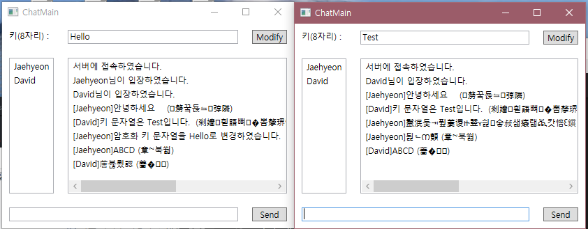

# DES 암호화 채팅 프로그램  

### 사용 기술 및 알고리즘  
  
* JHSocketEngine - TCP Socket Library (자체 제작, [링크](https://github.com/JaehyeonSK/JHSocketEngine))
* DES(Data Encryption Standard) - 암호화 알고리즘 (자체 제작, [링크](https://github.com/JaehyeonSK/DESAlgorithm))

### 언어 및 플랫폼  
  
* C#/WPF
* .Net Framework 4.5.2

### 기능 명세서  
* [pdf](docs/기능명세.pdf)  
* [docx](docs/기능명세.docx)  

### 스크린샷  
  

##### [그림1] 서버 시작 화면  
아이피를 선택 가능하며 포트 번호를 직접 지정한 후 Start 버튼을 눌러 서버를 시작할 수 있다.  

  
##### [그림2] 서버 동작 중 화면  
Stop 버튼을 눌러 Socket 통신을 종료할 수 있다.  

  
##### [그림3] 클라이언트 시작 화면  
접속하고 싶은 서버의 IP와 포트 번호, 원하는 닉네임을 지정한 후 Connect 버튼을 눌러 채팅 서버에 접속할 수 있다.

  
##### [그림4] 좌: 클라이언트1(Jaehyeon) / 우: 클라이언트2(David)  
좌측의 리스트 박스에는 현재 같은 채팅 서버에 접속 중인 유저의 닉네임이 표시되며 우측 리스트 박스에는 알림 메시지와 대화 메시지가 출력된다.  
또한, 상단의 Modify 버튼을 누르면 암호화 키 문자열을 변경할 수 있다.

  
##### [그림5] 클라이언트 간 채팅 화면  
메시지는 알림 메시지와 대화 메시지로 나뉜다.  
알림 메시지는 그대로 출력되는 반면, 대화 메시지에는 복호화된 평문과 암호문이 동시에 나타난다.

  
##### [그림6] 클라이언트1의 암호화 키 문자열 변경 화면  
클라이언트1의 기본 암호화 키 문자열인 test를 Hello로 변경하였다.

  
##### [그림7] 암호화 키 변경 후 클라이언트 간 채팅 화면  
클라이언트1이 암호화 키 문자열을 변경한 이후, 서로의 채팅 메시지가 정상적으로 출력되지 않는 모습을 확인할 수 있다.  

